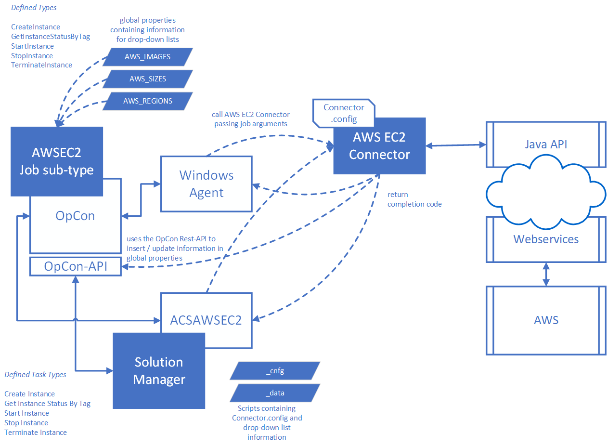

# AWSEC2
Amazon Elastic Compute Cloud (Amazon EC2) is a web service that provides resizable computing capacity—literally, servers in Amazon's data centers—that you use to build and host your software systems.

Amazon EC2 provides Virtual computing environments, known as instances. Amazon also provides preconfigured templates that can be used to create your instances, known as Amazon Machine Images (AMIs). 
The AMIs are packages that contain the bits you need for your server (including the operating system and additional software). Various configurations of CPU, memory, storage, and networking capacity 
are defined and known as instance types.

Amazon EC2 provides secure login information for your instances using key pairs (AWS stores the public key, and you store the private key in a secure place)

Amazon EC2 provides storage volumes for temporary data that's deleted when you stop or terminate your instance, which is known as instance store volumes. Persistent storage volumes for your data are 
provided using Amazon Elastic Block Store (Amazon EBS), which is known as Amazon EBS volumes. 

Amazon EC2 provides multiple physical locations for your resources, such as instances and Amazon EBS volumes, known as regions and Availability Zones. Provides a firewall that enables you to specify 
the protocols, ports, and source IP ranges that can reach your instances using security groups.

Amazon EC2 provides Static IP addresses for dynamic cloud computing, known as Elastic IP addresses.

Supports metadata, known as tags that you can create and assign to your Amazon EC2 resources.

Supports virtual networks that you can create that are logically isolated from the rest of the AWS cloud, and that you can optionally connect to your own network, known as virtual private clouds (VPCs).

The connector implementation consists of a Windows batch program that is executed by the Windows Agent. The connector is a Java program that uses the AWS Java SDK to communicate with the AWS environment.
 
The job definitions are entered as Windows jobs using the AWS EC2 job sub-type. When the job is scheduled by OpCon, the definitions are passed as arguments to the AWS EC2 Connector.

The AWS EC2 Connector supports various functions that allow an OpCon task to interact with instances within the AWS environment. A connector provides a single connection to the AWS environment. 
The user access key and secret key define the rights the connector has within the AWS environment. 

The AWS EC2 connector currently supports the following functions:

Function       | Description
-------------------------- | -----------
**CreateInstance**         | used to create a new instance from a defined Amazon Machine Instance image.
**GetInstanceStatusByTag** | used to determine the status of one or more instances.
**StartInstance**          | used to start one or more instances that are in a stopped state.
**StopInstance**           | used to stop one or more instances that are in a running state.
**TerminateInstance**      | used to remove an existing instance from the environment.

The connectors uses three global properties that allows the user to define information that will be available in the job subtype drop-down lists.

Property Name       | Description
--------------- | -----------
**AWS_IMAGES**  | Contains a list of images that cam be selected when creating instances.
**AWS_SIZES**   | Contains a list of server sizes that can be used when creating instances.
**AWS_REGIONS**	| Contains a list of regions where the instances can be found or created.

For CreateInstance and StartInstance operations, it is possible to save the instance identifier, the DNS name and the IP Address into properties (supports global, schedule and job instance properties). 
If a more than one instance is defined, an integer value is appended to the property names starting at 1 when saving the values. This capability allows an operation to perform an action on more than one instance.

The connector uses the OpCon-API to save the property values.

---